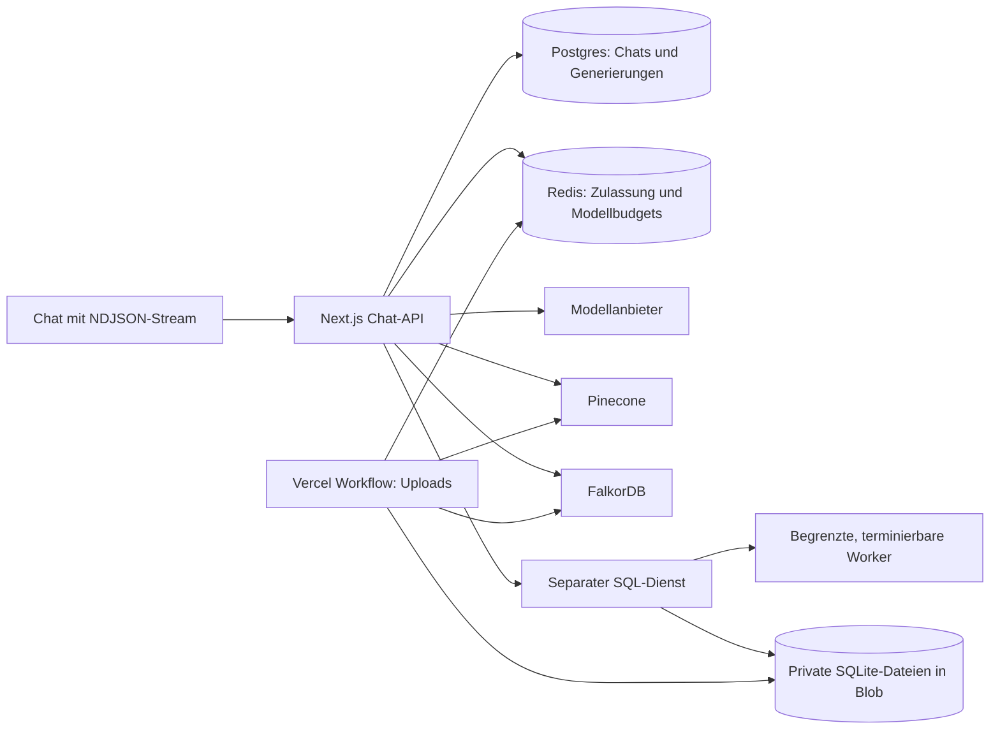

# Parallele Antworten und Chat-Bedienung

Diese Fassung führt Zulassung, isolierte SQL-Ausführung und verlässliche Chat-Zustände ein.
**1.000 laufende Antworten sind ein Lasttestziel, keine nachgewiesene Produktivkapazität.**
Der Grenzwert `CHAT_MAX_CONCURRENT=1000` stellt weder Modellkontingente noch CPU bereit.
Bei 30 Sekunden Antwortdauer bedeuten 1.000 laufende Antworten etwa 2.000 neue Fragen/min;
bei 600 Ausgabetokens je Antwort etwa 1,2 Mio. Ausgabetokens/min, zuzüglich Eingabe und Tools.

## Architektur



SQL wird im Chat ausschließlich über `SQL_EXECUTOR_URL` ausgeführt. Der Dienst validiert
den autorisierten Sammlungspfad, revalidiert gecachte Daten mit der Blob-ETag und führt
Abfragen in terminierbaren Workern aus. Dateigröße, Workerzeit, Warteschlange und
Ergebnisse sind begrenzt. Speichergrenzen müssen zusätzlich im Containeranbieter gesetzt
werden. Details und Startbefehle: [SQL-Dienst](../services/sql/README.md).

Graphabfragen erhalten vor der Ausführung maximal `LIMIT 200`; kleinere Limits bleiben
erhalten. `UNION` wird abgewiesen, weil frühere Zweige sonst unbeschränkt rechnen könnten.
FalkorDB behält zehn Sekunden Abfragefrist. Passende Indizes und Ausführungspläne müssen
anhand der tatsächlich eingespielten Graphen geprüft werden.
Graph-Lesezugriffe teilen sich die exklusive Sammlungssperre mit Import und Neuaufbau
(höchstens 30 Sekunden Lease, Freigabe sofort nach dem Ergebnis). Während eines Imports
werden neue Abfragen kurzzeitig abgewiesen; halbe Graphen werden nicht als Quellen gelesen.

## Migration und Rollout

1. Datenbanksicherung und Testkopie erstellen. Die additive Migration
   `drizzle/0004_chat_generierungen.sql` ergänzt Nachrichtenstatus, Feedback,
   Anfragekennungen, `chat_runs` und Indizes. Vorhandene Nachrichten bleiben erhalten.
   Bestehende Datenbanken mit bereits gepflegtem Drizzle-Migrationsjournal erhalten
   `npm run db:migrate`. Bei bisherigem `db:push` **nicht unbesehen sämtliche Migrationen
   erneut ausführen**: den bereits vorhandenen Schemastand abgleichen und `0004` einmalig
   mit dem etablierten Migrationsverfahren anwenden. Auf einer neuen Datenbank kann
   `npm run db:migrate` alle Migrationen ausführen, danach `npm run db:seed`.
2. SQL-Dienst mit Node 24 oder dem mitgelieferten Container starten. Privaten Blob-Token
   und einen mindestens 32 Zeichen langen `SQL_EXECUTOR_TOKEN` als Secrets hinterlegen.
   HTTPS-Adresse und denselben Diensttoken in der Chat-App konfigurieren. Healthcheck
   und eine echte Abfrage einer Testsammlung prüfen. Ohne Dienst gibt es keinen lokalen
   Fallback für SQL-Fragen; Uploads behalten SQLite/Blob bei.
3. Redis-, Modell- und Dienstbudgets aus `.env.example` auf bestätigte Quoten abstimmen.
   Die konservativen Modellstandards von 120 Aufrufen/min und 1 Mio. reservierten
   Tokens/min reichen nicht für den Zielbetrieb. Kapazität je tatsächlicher Modell-ID,
   Gateway/Provider-Routing und Account prüfen; bei gemeinsam genutzten Providerquoten
   deren Summe berücksichtigen. Automatische SDK-Retries sind im Chat ausgeschaltet.
4. `vercel.json` aktiviert Fluid Compute für neue Deployments. Im konkreten Projekt
   kontrollieren, dass die Einstellung greift. App, Postgres, Redis, SQL, Blob, Pinecone
   und FalkorDB nach tatsächlich verfügbaren Regionen ausrichten; die Region wird hier
   bewusst nicht geraten. [Vercel-Konfiguration](https://vercel.com/docs/project-configuration/vercel-json#fluid),
   [Skalierung und gleichzeitiger Start](https://vercel.com/docs/functions/concurrency-scaling).
5. Backend und UI gemeinsam ausrollen. `POST /api/chat` erwartet jetzt `chatId`,
   `requestId` und `question`, optional `collectionIds` und `detail`. Alte offene Tabs
   müssen neu laden. Alte, nicht an ein Konto gebundene Browserdaten unter
   `rag-chat-verlauf-v1` werden nicht automatisch importiert; serverseitige Verläufe
   bleiben erhalten. Die Migration vor dem neuen App-Deployment anwenden.
6. Referenzfragen und unten beschriebene Lastabnahme in einer getrennten Umgebung
   ausführen. Erst danach produktive Grenzen schrittweise anheben. Bei Rücknahme die
   additive Datenbankmigration stehen lassen; auslaufende Generierungen berücksichtigen.

## Zulassung und Tokenbudgets

| Einstellung | Standard | Wirkung |
|---|---:|---|
| `CHAT_MAX_CONCURRENT` | 1000 | Laufende Antworten über alle App-Instanzen |
| `SQL_MAX_CONCURRENT` | 32 | Zugelassene SQL-Aufrufe, zusätzlich zu lokalen Workergrenzen |
| `GRAPH_MAX_CONCURRENT` | 32 | Gleichzeitige Graphabfragen |
| `RETRIEVAL_MAX_CONCURRENT` | 100 | Gleichzeitige Suchoperationen |
| `INGESTION_MAX_CONCURRENT` | 8 | Schwere Upload-Verarbeitungsschritte |
| `INGESTION_MAX_STEP_MS` | 900000 | Gesamtfrist je schwerem Upload-Schritt |
| `CAPACITY_MAX_WAITERS` | 1000 | Maximale Wartende je Arbeitsklasse |
| `CAPACITY_WAIT_MS` | 5000 | Kurze Wartefrist, maximal konfigurierbar 30 Sekunden |
| `MODEL_REQUESTS_PER_MINUTE` | 120 | Rollende Reservierungen je Modell |
| `MODEL_TOKENS_PER_MINUTE` | 1000000 | Rollende Eingabe-/Ausgabetokenreservierung je Modell |
| `INGESTION_MODEL_REQUESTS_PER_MINUTE` | 30 | Zusätzliches Teilbudget für Upload-Modellaufrufe |
| `INGESTION_MODEL_TOKENS_PER_MINUTE` | 100000 | Zusätzliches Token-Teilbudget für Uploads |

`MODEL_CAPACITY_JSON` und `INGESTION_MODEL_CAPACITY_JSON` erlauben individuelle Werte:
`{"exakte-modell-id":{"rpm":120,"tpm":1000000}}`.
Upload-Aufrufe zählen zusätzlich gegen das gemeinsame Modellbudget. Fehlgeschlagene
Modellaufrufe behalten ihre Reservierung; eine manuelle Wiederholung reserviert erneut.
Die vorbestehenden Minuten- und Tageskontingente gelten weiterhin.

Redis-Lua-Skripte vergeben Plätze atomar und bereinigen abgelaufene Leases mit Redis-Zeit.
Chat-Generierungen haben 240 Sekunden Gesamtfrist bei 300 Sekunden Lease. SQL und
Retrieval bekommen Abbruchsignale; bereits laufende Graphbefehle enden spätestens über
ihren serverseitigen Timeout. Wartende Nutzer sehen den tatsächlichen Kapazitätsstatus
und können stoppen. Volle Warteschlangen erzeugen einen nachvollziehbaren Fehler mit
Retryfrist. Eine Warteschlange ersetzt keine Anbieterleistung.

Längere Upload-Schritte erneuern Kapazitäts- und Sammlungssperren alle 60 Sekunden;
bei Redisfehler, Eigentümerverlust oder Ablauf verhindern Checkpoints weitere
Schreiboperationen. SQL/Graph schließen Dokumente vor der Lockfreigabe ab. Graphimporte
bauen vor einem noch nicht abgeschlossenen Import aus allen fertigen Skripten neu auf,
damit abgebrochene Teilimporte verschwinden; dieser zusätzliche Aufwand gehört ins
Upload-Lastprofil. Anlegen, Abschluss und Entfernen von Dokumentmetadaten/Zählern sind
atomar; wiederholte Abschlüsse/Löschungen verändern die Zähler nicht doppelt. Die stabile
Workflow-Step-ID dedupliziert die Ingestion-Verbrauchsbuchung. Auch das Löschen einer
Tabelle oder eines Graphskripts hält die erneuerte Sperre bis zum Metadatenabschluss.

Der Antwortkontext enthält höchstens 18 abgeschlossene Nachrichten bzw. 8.000 Zeichen
Verlauf. Fundstellen werden dedupliziert und auf insgesamt 10.000 Zeichen begrenzt,
Werkzeugergebnisse auf 6.000 Zeichen je Aufruf. Das gemeinsame Budget schließt
Instruktionen, Verlauf, Werkzeuge und Fundstellen ein. UTF-8-Bytes dienen als konservative
Textabschätzung, nicht als exakte Tokenmessung. Pro Modellaufruf maximal 32.000
geschätzte Eingabetokens; kompakt 1.200 Ausgabetokens je Schritt und 2.400 insgesamt,
ausführlich 2.400 je Schritt und 4.800 insgesamt. Reservierter Gesamtumfang 100.000
bzw. 160.000 Tokens über alle Schritte. Abgelehnte Budgetüberschreitungen werden erklärt.

## Speicherung und Bedienung

Ein Serverlauf besitzt eine Anfragekennung und genau eine Nutzer-/Assistenten-Nachricht.
Die Anfragekennung ist an Konto, Chat, Frage, Sammlungsauswahl und Antwortlänge gebunden.
Eine fertige identische Anfrage wird ohne Modellaufruf wiedergegeben. Wiederholungen
fehlgeschlagener/gestoppter Anfragen verwenden dieselben Nachrichtenkennungen, erhöhen
aber die Versuchsnummer. Datenbankbedingungen verhindern, dass alte Versuche neue
Antworten überschreiben. Pro Chat läuft eine Generierung; der Kontext einer Wiederholung
endet an der ursprünglichen Frage. Bearbeiten stellt eine neue Frage am aktuellen Ende.

Der Stream sendet `start`, tatsächliche `status`-Ereignisse, `sources`, `step`, `text`,
`error` und abschließend `done` mit `completed`, `failed` oder `aborted`.
`done` allein ist kein Erfolg. Server-Checkpoints sichern während der Antwort etwa alle
zwei Sekunden bei eintreffendem Text/Toolergebnis und am Ende. Bei abruptem Prozessverlust
kann der Text seit dem letzten erfolgreichen Checkpoint fehlen. Nach 300 Sekunden wird
ein verwaister Lauf beim Lesen als unterbrochen angezeigt und kann wiederholt werden.

Die UI zeigt Laden/Fehler statt eines falschen leeren Verlaufs und sperrt Senden bis zum
geladenen Kontext. Stop erhält eine gekennzeichnete Teilantwort; Entwürfe bleiben beim
Schreiben während eines Streams erhalten. Automatisches Scrollen folgt nur am Ende,
sonst erscheint eine Rückkehr-Schaltfläche. Chatliste (30) und Nachrichten (40) werden
mit stabilen Zeit-/UUID-Cursorn paginiert. Streamänderungen werden 40 ms gebündelt;
Nachrichtenzeilen und Markdown sind memoisiert.

Quellenverweise öffnen einen Fundstellendialog mit geschütztem Originalzugriff.
PDF-Seiten können gezielt geöffnet werden, Audio-Quellen mit tatsächlich gespeicherten
Zeitangaben starten im Player an der Fundstelle. Andere Formate zeigen die vorhandene
Positionsangabe und den Download. Ältere Quellen ohne Dokument-ID behalten ihren Auszug.
Tabellen bieten lesbare Vorschauen, Kopieren und CSV-Export der **angezeigten Zeilen**;
Graph-Ergebnisse zeigen gespeicherte Beziehungen als Text. SQL/Cypher bleiben aufklappbar.
Kopieren, Frage bearbeiten, Feedback, Sammlungsauswahl, Antwortlänge, Einstiegsfragen und
der beim Seitenladen abgefragte Verarbeitungsstand ergänzen die vorhandene Gestaltung.

## Messung und Abnahme

`chat_run`-Logs enthalten Anfragekennung/Versuch, Status, Modell, ersten Antworttext,
Gesamtdauer, erste Phasenzeitpunkte, Zulassungsdauer, Anzahl Modellaufrufe/Toolschritte
und vom Anbieter gemeldete Nutzung. `usageComplete=false` kennzeichnet fehlende
Abrechnungsdaten, beispielsweise bei Abbruch. `usage_events` speichert bekannte Kosten;
unvollständige Nutzung mit dem Anbieterbericht abgleichen. Prompts und Antwortinhalte
werden dabei nicht ins Log geschrieben. SQL-Container: CPU, RAM, Queuezeit, 429/5xx,
Worker-Timeouts und OOM-Neustarts erfassen. Auf Redis/Postgres Aufrufe, Latenz und Limits
beobachten; zwei Sekunden Checkpointintervall sind selbst Teil des Lastprofils.

Der Lasttest braucht verschiedene Testkonten und vorhandene Sammlungen. Eine private
JSON-Datei enthält mindestens so viele unterschiedliche Konten/Sitzungen wie die größte
Stufe. Format und Optionen: `npm run lasttest -- --help` sowie `scripts/lasttest.ts`.
Jedes Konto kann Szenarien `vector`, `sql`, `graph` mit Frage und `collectionIds` besitzen.
Für gemischte Abfragen passende mehrere Sammlungen auswählen; die Typbezeichnung im
Bericht ist ein Fixture-Label und erkennt den tatsächlichen Datenbestand nicht selbst.

```bash
# Nur lokale Fixture-Prüfung, keinerlei Netzaufrufe:
npm run lasttest -- --url https://staging.example.org \
  --identities-file /private/tmp/lasttest-identities.json --dry-run

# Echte, kostenpflichtige Dauerlast nach Einrichtung der Testumgebung:
npm run lasttest -- --url https://staging.example.org \
  --identities-file /private/tmp/lasttest-identities.json \
  --stages 100,250,500,1000 --duration 300 --timeout 300 \
  --report /private/tmp/lasttest-report.json --run

# Zusätzlich gleichzeitiger Start von genau 1.000 Anfragen:
npm run lasttest -- --url https://staging.example.org \
  --identities-file /private/tmp/lasttest-identities.json \
  --stages 1000 --burst --report /private/tmp/lasttest-burst.json --run
```

Ein Sitzungs-Cookie kann erneuert oder abgelaufen sein. Fixture und Kontingente vor jedem
Lauf prüfen. Bei `--run` bestätigt der Server die tatsächliche Nutzeridentität beim
Anlegen jedes Testchats. Doppelte Identitäten brechen die Vorbereitung vor Lastbeginn
ab, auch bei unterschiedlichen Cookies oder Fixture-Labels. Der Bericht nennt nur die
Anzahl bestätigter unterschiedlicher Konten. `--dry-run` prüft nur die lokale Fixture.
Auf dem Lastgenerator ausreichend Verbindungen und CPU vorsehen, seine Auslastung messen
und bei Bedarf mehrere getrennte Generatoren mit disjunkten Konten verwenden.

Erfolgreich zählt nur `done.status=completed` mit nichtleerem Text ohne Streamfehler.
Echte Modellantworten werden zusätzlich mit `modelInvoked=true` ausgewiesen, damit
leere Sammlungen oder Wiederholungen den Modell-Durchsatz nicht künstlich erhöhen.
Berichte enthalten p50/p95/p99, Fehlerarten, erste Ereignisse, ersten Text und Laufzeit
einschließlich auslaufender Antworten. HTTP-Messung ersetzt keine Browsermessung.

Für jede Stufe Dokumente, SQL, Graphen separat und gemischt mit mehreren Datenbeständen
testen; zusätzlich parallele Uploads, langsame Abfragen, Anbieter-429, Stop, Netzverlust
und Serverneustart. Mobil echte Bildschirmtastatur, Quellen, lange Verläufe und Retry
ohne Duplikate prüfen. Referenzfragen mit erwarteten Ergebnissen/Fundstellen verwenden.
Die Referenzantworten müssen das begrenzte Retrieval- und Tokenbudget fachlich bestehen.

Anfängliche Zielwerte: lokale Rückmeldung unter 100 ms; p95 erster Antworttext unter
5 Sekunden für Dokumente bzw. 10 Sekunden für SQL/Graph; mindestens 99 % technischer
Erfolg aller zulässigen Anfragen bei vereinbarter Dauerlast. Überlastungsabweisungen
separat ausweisen und den Nenner nicht nachträglich zugunsten der Erfolgsquote verändern.
Quellenrichtigkeit und Antwortqualität separat bewerten. Produktionsquoten, tatsächliche
Regionen und ein echter 1.000er-Lastlauf sind durch lokale Code-/Komponententests nicht
nachgewiesen.
